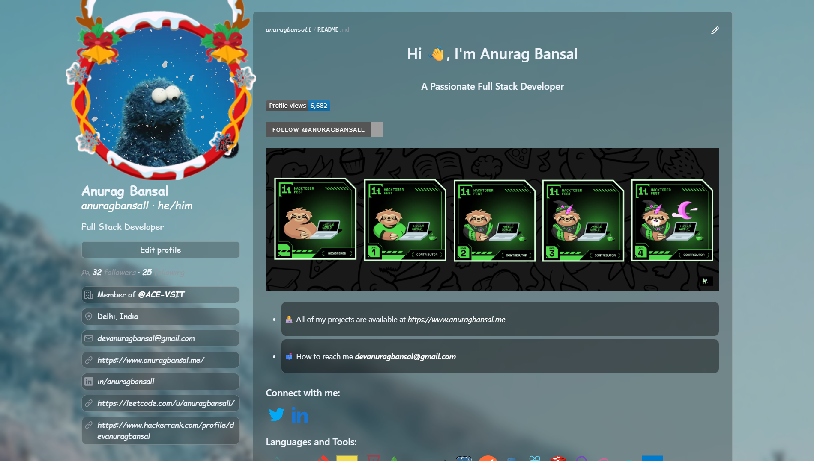

# GitHub Winter Edition

A lightweight Chrome extension that applies a cozy winter theme to GitHub. It adds a snow-fall overlay and a festive frame to your avatar on your profile page, and styles common UI elements with a soft, blurred, winter background.


## Demo



## Features

- Snow-fall overlay on your GitHub profile avatar
- Festive winter frame around the avatar
- Winter background image with subtle blur overlay
- Soft, translucent styling for buttons, tables, grids, and inputs
- Clean, cursive title font to match the seasonal vibe

## How It Works

This extension uses a Manifest V3 `content_script` that runs only on `https://github.com/*`:

- JavaScript ([content.js](content.js)) finds the avatar container (using the element with `aria-label="Change your avatar"`) on your own profile page and injects two images: a snow-fall overlay and a winter avatar frame.
- CSS ([styles.css](styles.css)) applies the winter background, blur overlays, borders, and font, and adjusts text colors and link hover states.
- Configuration lives in [manifest.json](manifest.json), which defines when the script and styles are applied and provides the extension icons from [assets/](assets/).

Note: The avatar-specific effect appears when the "Change your avatar" button exists (typically on your own profile page). The broader winter styling applies across GitHub pages that include a `main` element.

## Folder Structure

```
assets/              # Icons and visuals (icon.png, demo.png, snow-fall.gif, winter-avatar-frame.png, backgrounds)
content.js           # Injects snow-fall and avatar frame into the profile avatar container
manifest.json        # Chrome extension config (MV3)
styles.css           # Winter theme styles applied to GitHub UI elements
```

## Installation (Local)

Follow these steps to load the extension locally in Chrome (Windows):

1. Download or clone this repository to your machine.
2. Open Chrome and navigate to `chrome://extensions`.
3. Enable "Developer mode" (toggle in the top right).
4. Click "Load unpacked" and select the folder containing this project (the folder with `manifest.json`).
5. Visit `https://github.com/`. For the full avatar effect, open your own profile page.

### Microsoft Edge (Chromium) or Brave

- Edge: Go to `edge://extensions`, enable Developer mode, click "Load unpacked", select the project folder.
- Brave: Go to `brave://extensions`, enable Developer mode, click "Load unpacked", select the project folder.

## Usage

- Open GitHub in your browser after loading the extension.
- To see the avatar overlay and frame, open your own profile page (where the avatar change UI is present).
- The general winter styling applies to core UI components on GitHub pages.

## Permissions

- No special permissions are requested. The extension only injects a content script and stylesheet on `https://github.com/*`.

## Customization

- You can replace visuals in [assets/](assets/) and update references in [content.js](content.js) and [styles.css](styles.css).
- Currently, some visuals (snow-fall, frame, background) are loaded from URLs in the code. If you prefer fully offline/local assets, update the URLs in `content.js` and `styles.css` to point to the files in the `assets/` folder (e.g., `assets/snow-fall.gif`, `assets/winter-avatar-frame.png`, `assets/winter-bg.jpg`).

## Troubleshooting

- No avatar effects?
  - Make sure you are viewing your own profile page, where the avatar change control exists.
- No styling changes?
  - Refresh the page (Ctrl+F5) after loading the extension.
  - Confirm the extension is loaded and enabled in `chrome://extensions`.
  - Ensure you are on `https://github.com/*`.
- Images not appearing?
  - Network policies may block loading remote images; switch to local asset paths in the code as described above.

## Uninstall

- Open `chrome://extensions`, find "GitHub Winter Edition", and toggle it off or click "Remove".

## Notes

- Built for Manifest V3.
- Designed to be minimal and easy to modify.
